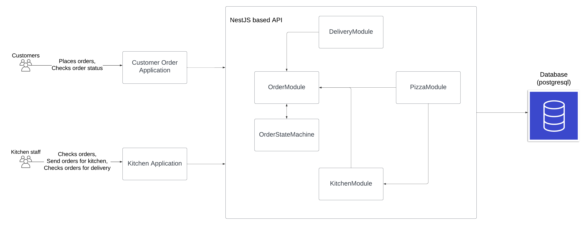

# Pizza Delivery Service Architecture Overview

## Architecture Overview

The architecture of the pizza delivery service is designed to be both scalable and modular, catering to the specific functionalities required for efficient operation. This system architecture is structured around two main components: the front-end applications and the back-end API.

### Front-End Applications

The system features two front-end applications, both developed using the React framework. React is chosen for its efficiency in building interactive user interfaces, its component-based architecture, and its wide ecosystem, which supports rapid development and maintenance. The two applications likely serve distinct user roles:

- **Customer Order Application**: Designed for the end-users who place orders. It provides a user-friendly interface for menu browsing, order customization, payment, and tracking delivery status.

- **Kitchen Application**: Intended for the kitchen staff, enabling them to manage orders, update kitchen statuses.

### Back-End API

The back-end functionality is handled by an API developed with the NestJS framework. NestJS is selected for its scalability, its use of TypeScript (enhancing code reliability and maintainability), and its efficient handling of asynchronous operations, which is crucial for real-time data processing in a delivery service. The API is designed with a modular structure, comprising the following key modules:

- **Order Module**: Manages order placements, updates, and status tracking. It interfaces with the Pizza and Billing modules to process orders and handle payments.

- **Kitchen Module**: Oversees the preparation of orders, from dough preparation to baking. It communicates with the Order module to receive preparation requests and updates the order status accordingly.

- **Pizza Module**: Responsible for menu management, including pizza options, ingredients, and customization features. This module ensures that the customer application displays up-to-date and accurate menu information.

- **Delivery Module**: Handles the assignment of delivery personnel, tracking of deliveries, and status updates to ensure timely delivery to customers. It interacts with the Order module to fetch delivery details.

- **Billing Module**: Manages payment processing, including invoice generation, payment tracking, and confirmation of payment status. It works closely with the Order module to secure order payments.

Each module in the NestJS API consists of controllers, services, and entities for the TypeORM database, facilitating a clear separation of concerns and enhancing the maintainability of the codebase. Controllers handle incoming requests and responses, services contain the business logic, and entities define the database models.

This architecture supports efficient development and future expansion. The modular approach allows for easy updates and addition of new features without disrupting the existing system functionality, making it well-suited for the dynamic requirements of a pizza delivery service.

## State Machine

The state machine for a pizza delivery service can be described through a series of states from the moment an order is received until it is either completed or cancelled. Here's a brief description of each state in the process:

- **Pending**: This is the initial state of an order when it is first received. At this point, the order has been placed but not yet paid for online. The system awaits payment initiation from the customer.

- **Awaiting Billing**: If the customer chooses not to pay online immediately, the order transitions to this state. The system is waiting for the customer to complete the payment. This state underscores the necessity for timely payment to proceed with the order preparation.

- **Cancelled**: An order moves to this state under two conditions:
  - If the customer does not complete the payment within 30 minutes of the order being placed and being in the "Awaiting Billing" state.
  - If the customer refuses to accept the order upon delivery, indicating a rejection of the transaction or delivery issues.

- **Confirmed**: Once the customer completes the payment within the specified 30-minute window, the order status is updated to "Confirmed." This state indicates that the payment has been successfully processed, and the order is officially accepted for preparation.

- **Preparing**: Following confirmation, the order enters the "Preparing" state, where the pizza is being made. This includes all steps of preparation, from dough stretching to topping application and baking.

- **Ready for Pickup**: After the pizza is prepared, the order status is updated to "Ready for Pickup." This state indicates that the pizza is ready to be handed off to the delivery personnel. It is the transitional phase before the delivery process begins.

- **Delivery**: The order is in the "Delivery" state when it is out for delivery to the customer's location. This state encompasses the journey of the pizza from the store to the customer's doorstep.

- **Completed**: If the customer accepts the order upon delivery, it is moved to the "Completed" state. This indicates that the transaction has been successfully finalized, and the delivery process is concluded satisfactorily.

Each state in this machine represents a specific phase in the pizza delivery process, providing clear indicators of progress and facilitating efficient management of orders from receipt to completion or cancellation.
